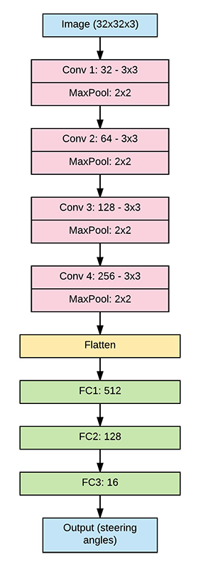
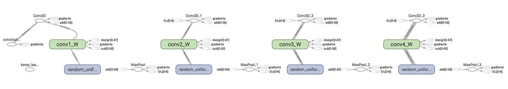
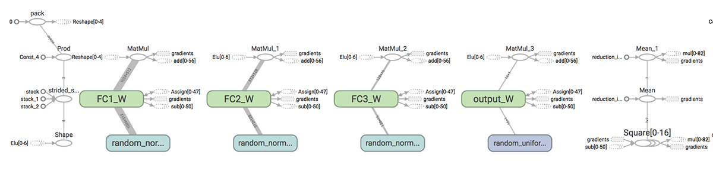
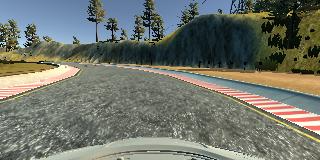
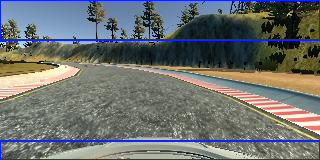
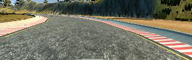
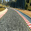
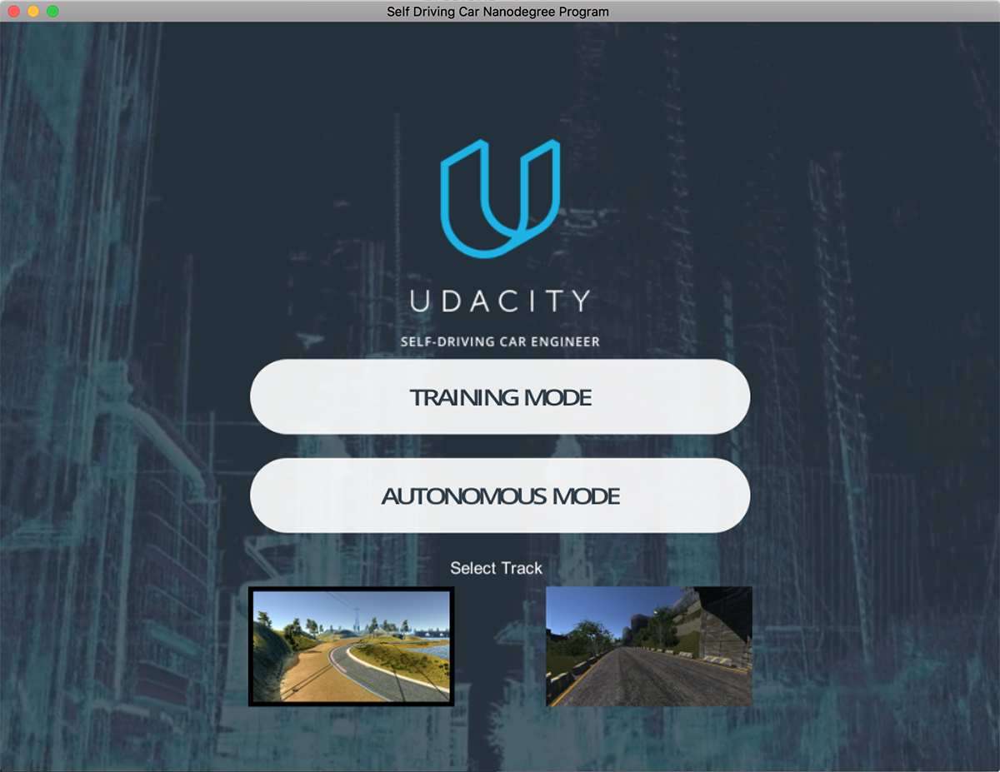
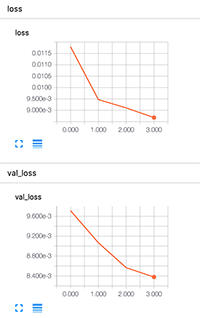

Behavior Cloning
=============

## Introduction
This project, **Behavior Cloning**, is for [Udacity](www.udacity.com) [**"Self-Driving Car Engineer Nanodegree"** program](https://www.udacity.com/course/self-driving-car-engineer-nanodegree--nd013).

## Model Architecture Design
Convolution Neural Network (CNN) is the dominant method in deep learning for visual recognition. I can "reuse" the architecture from Project 2 - Traffic Sign Classifier - to attack this problem.

The differences would be that,

- Input images have different sizes
- CNN for Project 2 was used for classifier, while the CNN for this project needs to return a value
- Use [Keras](https://keras.io/) for CNN implementation and store model

I used Nvidia's [End-to-End Deep Learning for Self-Driving Cars paper](https://devblogs.nvidia.com/parallelforall/deep-learning-self-driving-cars/) to guide my CNN design.

### Architecture

- Conv1: input: 64 x 64 x 3, filter: 3 x 3
  - MaxPooling: 2 x 2
  - ELU
- Conv2: filter: 3 x 3
  - MaxPooling: 2 x 2
  - ELU
- Conv3: filter: 3 x 3
  - MaxPooling: 2 x 2
  - ELU
- Conv4: filter: 3 x 3
  - MaxPooling: 2 x 2
  - ELU
- FC1 (Fully Connected Nodes): 512 nodes
  - ELU
- FC2: 128 nodes
  - ELU
- FC3: 16 nodes
  - ELU
- Output (Steering angles)

### Chart




### Code Snippet
Here is the code snippet for my CNN.

```
model = Sequential()
# Convolution layer 1, 3 x 3 filter, Maxpool 2 x 2
model.add(Conv2D(32, 3, 3, input_shape=(image_size, image_size, 3), name='conv1'))
model.add(MaxPooling2D((2, 2)))
model.add(ELU())

# Convolution layer 2, 3 x 3 filter, Maxpool 2 x 2
model.add(Conv2D(64, 3, 3, name='conv2'))
model.add(MaxPooling2D((2, 2)))
model.add(ELU())

# Convolution layer 3, 3 x 3 filter, Maxpool 2 x 2
model.add(Conv2D(128, 3, 3, name='conv3'))
model.add(MaxPooling2D((2, 2)))
model.add(ELU())

# Convolution layer 3, 3 x 3 filter, Maxpool 2 x 2
model.add(Conv2D(256, 3, 3, name='conv4'))
model.add(MaxPooling2D((2, 2)))
model.add(ELU())

model.add(Flatten())

# Fully connected layer 1
model.add(Dense(512, name='FC1', init='he_normal'))
model.add(ELU())

# Fully connected layer 2
model.add(Dense(128, name='FC2', init='he_normal'))
model.add(ELU())

# Fully connected layer 3
model.add(Dense(16, name='FC3', init='he_normal'))
model.add(ELU())

model.add(Dense(1, name='output'))
```

### TensorBoard output




## Data Preprocessing

### Data used

I used [Udacity sample data for track one](https://d17h27t6h515a5.cloudfront.net/topher/2016/December/584f6edd_data/data.zip) for my training and testing. Extract the zip to IMG folder.

There are 8036 images each for center, left and right camera channels, totally 24108 images in the Udacity sample dataset. My implementation only uses the 8036 images from the center camera.

### Image size
Nvidia's paper uses the "raw" images of size 66 x 200.
My model uses 64 x 64, similar to project 2. Using smaller image can speed up the processing speed of the network.

### Image preprocessing
The raw image is 160 x 320.
I cropped out top 40 and bottom 20 pixels for each image, and resize them to 64 x 64 images to feed into my CNN.

- Input image (160 x 320)



- Remove top (40 x 320) and bottom (20 x 320)



- Crop (100 x 320)



- Resize (64 x 64)




## Model Training

### Training/Validation

Used Keras provided [validation_split](https://keras.io/getting-started/faq/#how-is-the-validation-split-computed) and [shuffle](https://keras.io/getting-started/faq/#is-the-data-shuffled-during-training) parameters to shuffle and split 25% of dataset for validation.


```
history = model.fit(X_train, Y_train,
                    batch_size=32, nb_epoch=4,
                    verbose=1, validation_split=0.25, shuffle=True)

```


For the 8036 images, Keras shuffles the dataset, and uses the first 6027 images as the training dataset and 2009 images as the validation set.


### Optimizer
Used Adam Optimizer with 0.0001 learning rate.

```
adam = Adam(lr=0.0001, beta_1=0.9, beta_2=0.999, epsilon=1e-08, decay=0.0)
model.compile(adam, "mse")
```

### Saving model


```
# serialize model to JSON
model_json = model.to_json()
with open("model.json", "w") as json_file:
    json_file.write(model_json)
# serialize weights to HDF5
model.save_weights("model.h5")
print("Saved model to disk")
```

### Training
Use
```python3 model.py```
to train the model. I use a 2014 MacBook Pro (2.2GHz i7, 16G DDR3), it takes under 4 minutes to train the model.


## Testing
### Changes in drive.py


#### Image preprocessing

The simulator takes real-time images to feed into my model to get steering angles. The input image is 160 x 320. Those images shall be preprocessed before feeding into the model.

- Cropping
- Resizing
- Normalizing

```
imgString = data["image"]
image = Image.open(BytesIO(base64.b64decode(imgString)))
image = image.crop((0, 40, 320, 140))
image = image.resize((64, 64))
image_array = np.asarray(image)/255.0
transformed_image_array = image_array[None, :, :, :]
```
#### Tune down the throttle when there is a big turn


The throttle value was set to 0.2.

Code is added to tund down the throttle to 0.15 when there is a big turn.

```
# The driving model currently just outputs a constant throttle. Feel free to edit this.
throttle = 0.2
if abs(steering_angle) > 0.2:
    throttle = 0.15
```

### Testing
Use
```python3 drive.py model.json```
to test the model with Udacity simulator.




## Model Tuning

Following things are tried to finalize the network

- 3 or 4 convoltion layer: 4 layers is better
- Adam optimizer and different learning rates: 0.0001 runs better
- ELU vs relu: ELU is better
- Dropout: **No dropout layer is used since the dataset is small and no concern of overfitting.**
- Nodes of each FC layers
- Use 'he_normal' to initialize FC nodes
- Batch size
- Number of Epochs


#### Losses

During tuning, the values training and validation loss are monitored.



#### Test drives

Test drives are also performed to check whether the car can stay on track.

***Luckily, it stays on track, finally!***


## References

- [Nvidia End-to-End Deep Learning for Self-Driving Cars paper](https://devblogs.nvidia.com/parallelforall/deep-learning-self-driving-cars/)

## ScreenCast

